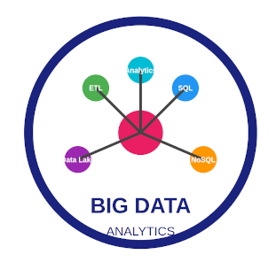

# Bienvenido a la web de clases de Luis García 

Esta es la web que uso para colgar los contenidos de las asignaturas que imparto en Ciclos Formativos

## Grado Medio SMR
  * [Sistemes Operatius Monolloc](SOM/IndiceSOM.md) 

## Curso de especializacion en Inteligencia Artificialy Big Data ##
  * [Big Data Aplicado](BDA/IndiceBDA.md) 
  * [Sistemas Big Data](SBD/IndiceSBD.md) 
  * [Power BI](PowerBI/IndicePowerBI.md) 

<!-- **Última actualización:** {{ git_revision_date_localized }} -->

<figure markdown="span">
  { width=50%}
  <figcaption>Image caption</figcaption>
</figure>